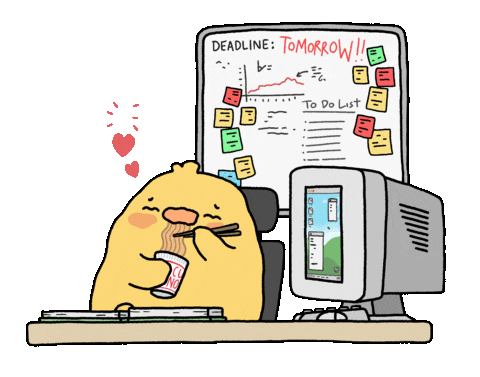

<!-- ========================= HEADER ========================= -->

<h1 align="center">
  
</h1>

  

<h2 align="center">🙏 Namaste, I'm RJ Nandani</h2>

<h3 align="center">
AI/ML Developer • Full Stack Engineer • Real-Time Systems Builder
</h3>

---

<!-- ========================= ABOUT ========================= -->

# 🌙 About Me

- 🚀 Currently building **Framely** — collaborative real-time photo booth  
- 🤖 Passionate about **AI/ML + Full Stack Development**  
- ⚡ Exploring **WebRTC, WebSockets, and RAG systems**  
- 🧠 Love building intelligent practical applications  
- 💻 Java • Spring Boot • Python • JavaScript  
- 🔥 Always learning futuristic technologies  

   

---

<!-- ========================= SOCIAL ========================= -->

# 🌐 Connect With Me

---

<!-- ========================= TECH STACK ========================= -->

# 💻 Languages & Tools

---

<!-- ========================= GITHUB STATS ========================= -->

# 📊 GitHub Stats

---

# ⚡ Most Used Languages

---

<!-- ========================= PROJECTS ========================= -->

# 🏆 Featured Projects

## 📸 Framely — Real-Time Collaborative Photo Booth

- 🔥 WebSocket + WebRTC for real-time sync  
- 🎨 Multiple layout templates with PDF export  
- ⚡ Built with Spring Boot + JavaScript  

---

## 💬 PDF Q&A Bot

- 🤖 Retrieval-Augmented Generation (RAG)  
- 📄 Upload PDFs and chat instantly  
- 🐍 Built with Python + LangChain  

---

## 🏥 Hospital Management System

- 💊 Real-time patient management  
- 📅 Doctor scheduling system  
- 🔐 Spring Boot REST APIs  

---

## 🤖 ML Sorting Optimizer

- 📊 Adaptive sorting prediction  
- ⚡ ML-based optimization  
- 🧠 Built using Scikit-learn  

---

<!-- ========================= GRAPH ========================= -->

# 📈 Contribution Graph

---

<!-- ========================= QUOTE ========================= -->

# 💡 Dev Quote

---

<!-- ========================= SNAKE ========================= -->

# 🐍 Contribution Snake

---

<!-- ========================= VISITOR ========================= -->

# 👀 Profile Views

---

<!-- ========================= FOOTER ========================= -->

<h2 align="center">

✨ "Build • Break • Learn • Repeat" ✨

</h2>
